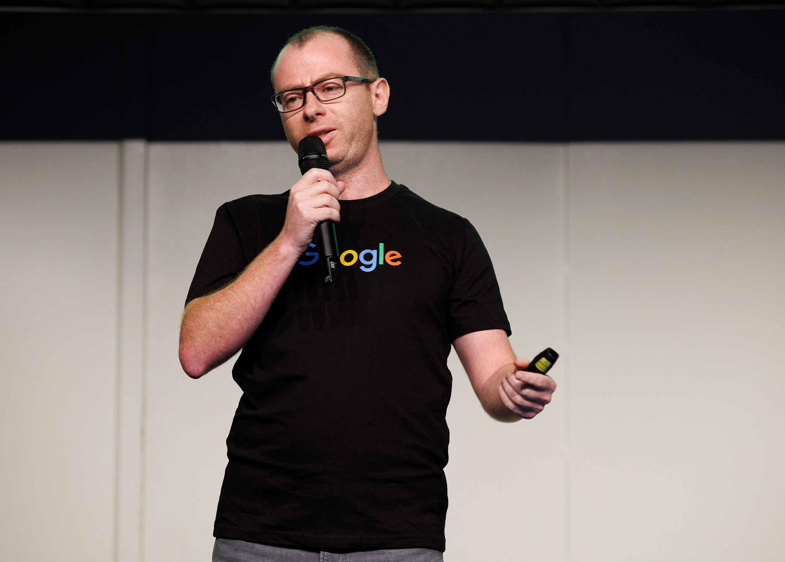

I am a Senior Software Engineer working as a Partner Engineer at Google. I guide developers at 
top companies on [Google Play Games Services](https://developer.android.com/games/pgs/overview) integrations.
I enjoy the intersection of technology, problem solving and people.
 
My expertise includes:  
* Backend Development - Sign in, Recall and Achievements APIs with QPS Management    
* Java & Optimizations - Java development, multi-threading, object-oriented design and performance tuning
* System Diagnostics - Android performance analysis, Bash scripting and Git
* Outreach - technical writing, mentoring and public speaking

I received my masters in Software Engineering and MBA in Marketing from [Reichman 
University](https://www.runi.ac.il/en/) in Israel.

You can reach me at <boris@farber.io>.

# On web
* [LinkedIn](https://www.linkedin.com/in/borisfarber/) 
* [Github](https://github.com/borisf) 
