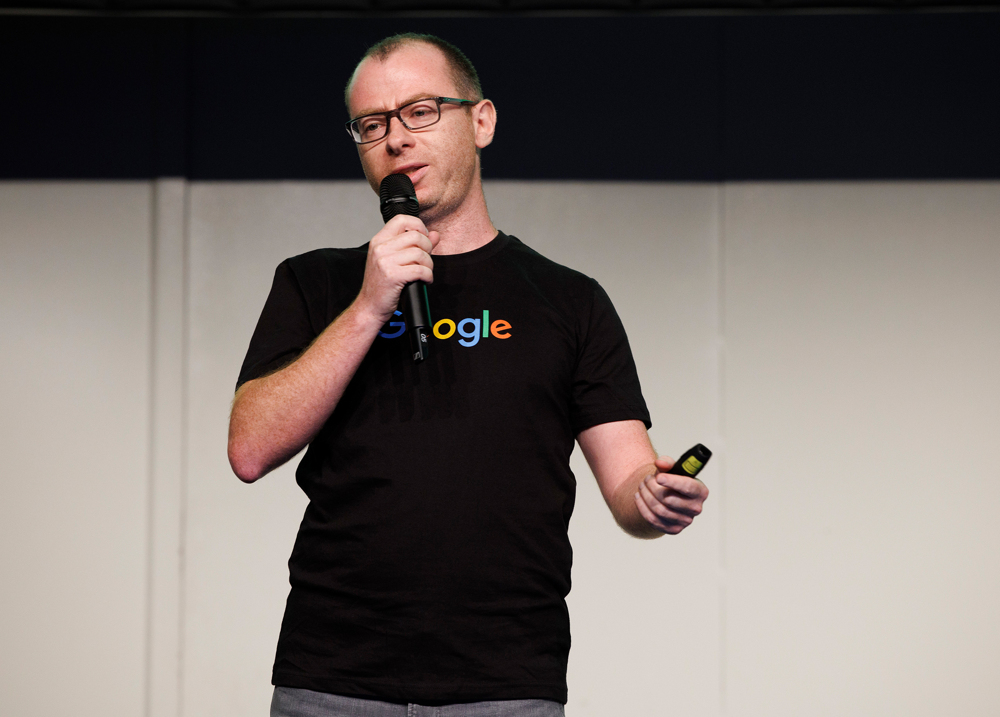

Hi 👏, and welcome to my site!

I am a Senior Software Engineer and a Tech Lead working as a Partner Engineer at Google. I guide developers at 
game companies on [Google Play Games Services](https://developer.android.com/games/pgs/overview) client-server integrations.
I enjoy the intersection of technology, problem solving and people. I have developed in C/C++, Java, Kotlin and Rust.
 
My expertise includes:  
* Business - stakeholder management and customer facing
* System Design - AI, API development, Linux, design, analysis   
* Technical Leadership - technical writing, escalations, mentoring and public speaking

I received my masters in Software Engineering and MBA in Marketing from [Reichman 
University](https://www.runi.ac.il/en/) in Israel.

You can reach me at <boris@farber.io>.

# On web
* [LinkedIn](https://www.linkedin.com/in/borisfarber/) 
* [Github](https://github.com/borisf) 
