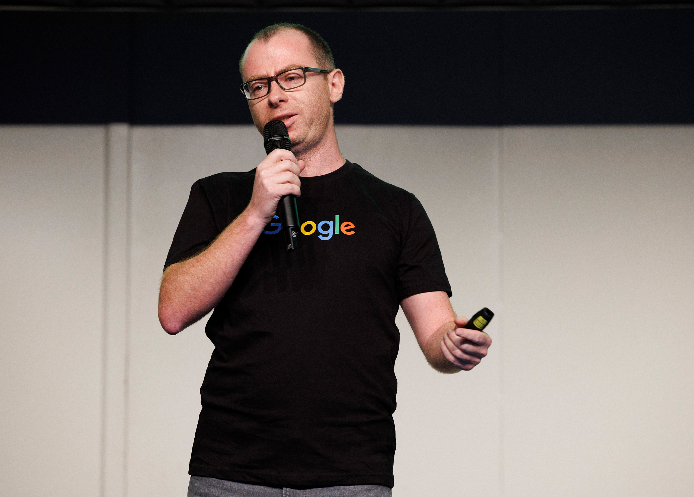

Hi 👏, and welcome to my site!

I am a Senior Software Engineer and a Tech Lead working as a Partner Engineer at Google. I specialyze at memory optimizations.
I enjoy the intersection of technology, problem solving and people.
 
My expertise includes:  
* Tech - Java and C/C++
* System - AI, Linux memory optimizations
* Tech Lead - mentoring, public speaking, stakeholder management and customer facing

I received my masters in Software Engineering and MBA in Marketing from [Reichman 
University](https://www.runi.ac.il/en/) in Israel.

You can reach me at <boris@farber.io>.

# On web
* [LinkedIn](https://www.linkedin.com/in/borisfarber/) 
* [Github](https://github.com/borisf) 
